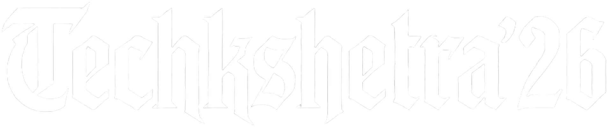

### The biennial technical festival at Rajagiri School of Engineering & Technology

---

## 📁 File Structure

```
techkshetra26/
├── public/
│   ├── favicon.png                  # Site favicon
│   └── fonts/
│       └── milker-regular.otf       # Custom display font
│
├── src/
│   ├── assets/                      # Static media assets
│   │   ├── events/                  # ← Event posters (see below)
│   │   ├── gallery/                 # ← Gallery photos (see below)
│   │   ├── TK26-logo-white.webp     # Logo (white variant)
│   │   ├── TK26-logo-color.webp     # Logo (color variant)
│   │   ├── TK26-icon.webp           # App icon
│   │   ├── TK26-icon-512.webp       # App icon (512px)
│   │   ├── TK26-angel.webp          # Hero / promo image
│   │   ├── TK26-genesis.webp        # Genesis promo image
│   │   ├── TK26-shirt.webp          # Merchandise image
│   │   ├── RSET-photo.webp          # College photo
│   │   └── RSET-jubilee-bw.webp     # Jubilee B&W image
│   │
│   ├── components/                  # React components
│   │   ├── css/                     # Component-level CSS modules
│   │   ├── About.tsx
│   │   ├── Countdown.tsx
│   │   ├── EventCarousel.tsx
│   │   ├── Events.tsx
│   │   ├── FloatingBottomBar.tsx
│   │   ├── FluidCursor.tsx
│   │   ├── Footer.tsx
│   │   ├── Gallery.tsx
│   │   ├── HeroGlitch.tsx
│   │   ├── HomePage.tsx
│   │   ├── InitialLoader.tsx
│   │   ├── LiquidBackground.tsx
│   │   ├── Navigation.tsx
│   │   ├── ScrollReveal.tsx
│   │   └── Tshirts.tsx
│   │
│   ├── hooks/
│   │   └── usePrefersReducedMotion.ts
│   ├── styles/
│   │   └── tokens.css               # Design tokens / CSS variables
│   ├── types/
│   │   └── sun.types.ts
│   ├── App.tsx
│   ├── App.module.css
│   ├── index.css                    # Global styles
│   └── main.tsx                     # App entry point
│
├── index.html
├── vite.config.ts
├── package.json
└── tsconfig.json
```

---

## 🖼️ Event Posters & Media

All event posters and gallery photos are stored as `.webp` files for optimised web delivery.

### Event Posters — `src/assets/events/`

| File | Event |
|------|-------|
| `ADAPTATHON.webp` | Adaptathon |
| `ATV Build&Race.webp` | ATV Build & Race |
| `Capital_Clash.webp` | Capital Clash |
| `Circuit safari.webp` | Circuit Safari |
| `Crushing Depths CTF.webp` | Crushing Depths CTF |
| `DRONIX.webp` | Dronix |
| `Ghost_Protocol.webp` | Ghost Protocol |
| `Hello Friday.webp` | Hello Friday |
| `LightLensAction.webp` | Light Lens Action |
| `Metro Rethink.webp` | Metro Rethink |
| `Payload.webp` | Payload |
| `Payload_Electronauts.webp` | Payload Electronauts |
| `Post it up poster.webp` | Post It Up |
| `ReviveNight.webp` | Revive Night |
| `Rextech.webp` | Rextech |
| `Scenious 4.0 .webp` | Scenious 4.0 |
| `Traceback.webp` | Traceback |
| `amongus.webp` | Among Us |
| `botforge.webp` | BotForge |
| `circuit_quest.webp` | Circuit Quest |
| `enduro.webp` | Enduro |
| `mercedes workshop.webp` | Mercedes Workshop |
| `shahi dossier.webp` | Shahi Dossier |

### Gallery Photos — `src/assets/gallery/`

Photos are named `1.webp` through `14.webp` (`src/assets/gallery/1.webp` … `src/assets/gallery/14.webp`).

### Other Branding Assets — `src/assets/`

| File | Description |
|------|-------------|
| `TK26-logo-white.webp` | Main logo (white, for dark backgrounds) |
| `TK26-logo-color.webp` | Main logo (full colour) |
| `TK26-icon.webp` | Square app icon |
| `TK26-icon-512.webp` | Square app icon (512 × 512 px) |
| `TK26-angel.webp` | Hero / promotional graphic |
| `TK26-genesis.webp` | Genesis promo graphic |
| `TK26-shirt.webp` | Merchandise / T-shirt image |
| `RSET-photo.webp` | Campus photograph |
| `RSET-jubilee-bw.webp` | Jubilee black-and-white graphic |

---

## Contributors

<a href="https://github.com/orbitronhd/techkshetra26/graphs/contributors">
  
</a>

## Note to Juniors
For all future website teams do not under any circumstances do any other committee work.